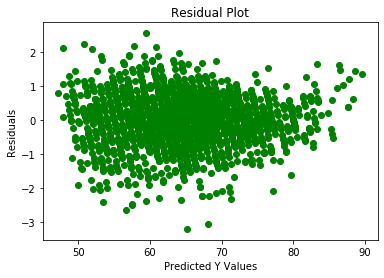

# How are the Major Player Attributes Related to the Overall Ratings of Players in Fifa 20? (An Insight using Multiple Linear Regression in Python)

## Part 1: Project Background 
  The Fifa soccer video game series has always been a passion of mine since I was twelve. I was always very curious of how the major attribute statistics of players (typically pace, shooting, dribbling, passing, physical, defending for field players and diving, handling, kicking, reflexes, speed, positioning for goalkeepers) were related to the overall statistic. I decided to explore the variables using multiple linear regression in order to predict the overall using major attributes and learn about their relationship. The code can be seen on the ipynb file in this repo, and the dataset here: https://www.kaggle.com/stefanoleone992/fifa-20-complete-player-dataset

## Part 2: Data Cleaning
  In this part of the project, I observed the data from a bird's eye view and decided to go deeper. Here are some of the aspects that I learned about the data and my relevant actions done.
  - The data consisted of 18278 observations and 104 columns
  - The data had no missing values 
  - The 'Player Position' column consisted of more than 600 unique positions
  - To observe how different attributes affect different players, I divided the dataset into three sub-datasets: defensive field players, non-defensive field players, goalkeepers
  
## Part 3: Exploratory Data Analysis
  In EDA, I attempted to explore the data in-depth. I observed correlation coefficients, distributions, basic statistical summaries, and pairwise plots for each of the sub-datasets. My findings include:
  - For defensive field players, Defending (r = 0.8203) and Passing (r = 0.7946) seem to have the highest correlations with overall. Pace had the lowest (r = 0.0793).
  - For non-defensive field players, Passing (r = 0.6696) and Dribbling (r = 0.5835) seem to have the highest correlations with overall. Pace (r = 0.1933) also seems to have the lowest.
  - For goalkeepers, Diving (r = 0.9489) had the highest and Speed (r = 0.4807) had the lowest correlations with overall, but other attributes such as Handling, Reflexes, Positioning all had correlation values above 0.9 and were highly correlated with overall as well. 
  - The overall statistic seem to be normally distributed.
    
  - The correlation coefficients were reflected on the pairplots with strong linearity for certain variables and the overall.

## Part 4: Model Building and Evaluation
  For this part, I built multiple linear regression models with ordinary least squares methods for each of the sub datasets. I split each dataset into train(80%)/test(20%) sets.
  - For defensive field players: predicted variable- Overall, predictor variables- Pace, Shooting, Passing, Dribbling, Physic, Defending (Results = R-squared(test data) = 0.8972, test MSE = 4.3509 )
  - For non-defensive field players: predicted variable- Overall, predictor variables- Pace, Shooting, Passing, Dribbling, Physic (Results = R-squared(test data) = 0.6847, test MSE = 15.2473)
  - For goalkeepers: predicted variable- Overall, predictor variables- Pace, Shooting, Passing, Dribbling, Physic, Defending (Results = R-squared(test data) = 0.9902, test MSE = 0.5687) 
  (Bonus: for goalkeepers, to check for linearity, I created a residual plot of residuals vs predicted y-values. The datapoints did not follow a specific pattern, indicating that there is a significant chance of linearity among the goalkeeper sub-dataset)
  

## Part 5: Final Thoughts and What I've Learned
  Through this project, I had some interesting findings and new material that I've learned.
  - Multiple Linear Regression worked best on the goalkeeper sub-dataset in predicting the overall using major player attributes
  - It seems that non-defensive field player overall cannot be completely explained with multiple linear regression.
  - Although multiple linear regression cannot perfectly explain the relationship between the variables in predicting overall, the following are equations with coefficients that resulted from this project:
  - [Pretty Good!] (defensive field players) Overall = 6.6262 + 0.0031*(Pace) - 0.0017*(Shooting) + 0.2805*(Passing) + 0.1566*(Dribbling) + 0.1032*(Physic) + 0.4143*(Defending)
  - [Good!] (non-defensive field players) Overall = 19.0332 - 0.0476*(Pace) + 0.0017*(Shooting) + 0.2171*(Passing) + 0.2544*(Dribbling) + 0.3479*(Physic)
  - [Okay...] (goalkeepers) Overall = -1.0309 + 0.2416*(Diving) + 0.2179*(Handling) + 0.0558*(Kicking) + 0.2476*(Reflexes) + 0.0142*(Speed) + 0.2499*(Positioning)
  
  - (and some other technical material I've learned)
  - Importance of Cleaning the Dataset
  - Importance of Knowing and Exploring the Dataset
  - Implementation of Multiple Linear Regression in Python
  - Fundamental Ideas of Multiple Linear Regression
  - Evaluating and Comparing Different Linear Regression Models
  - Some Data Visualization Methods in Python (Density Plots and Pairplots)
  - Further Possibilities & Next Steps to Take in Learning about Regression

## Part 6: Resources that Helped Me with this Project

- https://datatofish.com/multiple-linear-regression-python/
- https://searchengineland.com/heres-how-i-used-python-to-build-a-regression-model-using-an-e-commerce-dataset-326493
- http://faculty.marshall.usc.edu/gareth-james/ISL/
- https://www.kaggle.com/stefanoleone992/fifa-20-complete-player-dataset 
- https://python-graph-gallery.com/74-density-plot-of-several-variables/
